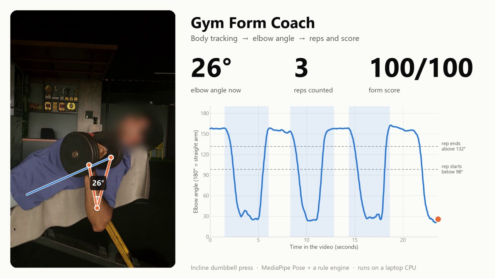
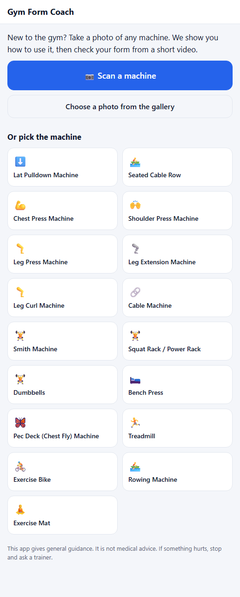
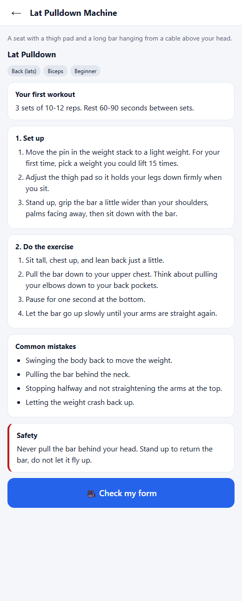
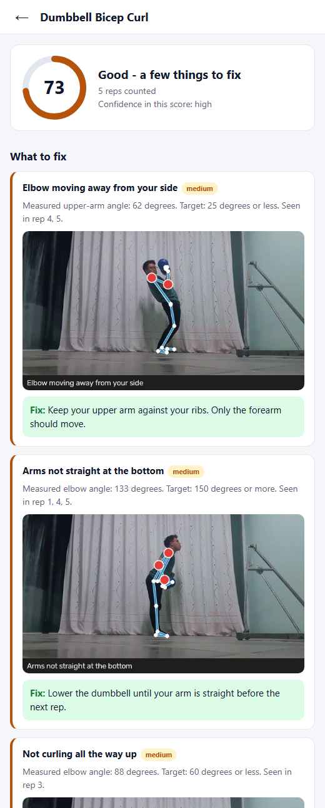
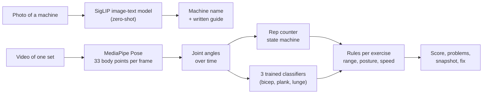
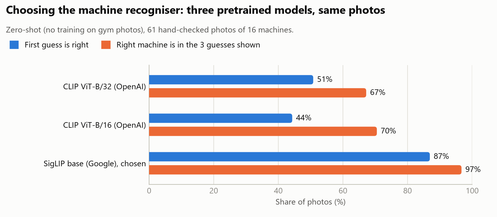
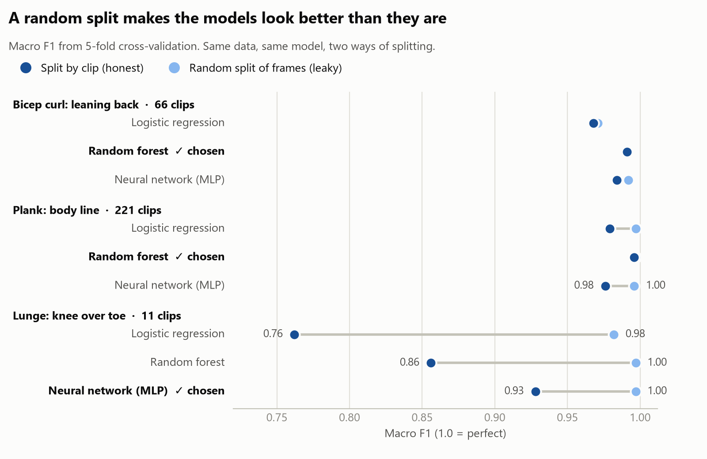

# Gym Form Coach

**Point your phone at a gym machine. Learn how to use it. Film one set. See what to fix.**

A working prototype for people who are new to the gym:

1. **Take a photo of a machine** - the app names it.
2. **Read the guide** - setup, how to do the exercise, common mistakes, safety.
3. **Upload a video of one set** - the app counts reps, gives a score out of 100, shows the frame
   where something went wrong, and says how to fix it.
4. **Watch your set back** - the app makes a review video: your clip with the measured joint and its
   angle drawn on it, next to a graph of that angle with every counted rep and its score.

## Demo (26 seconds)

[](docs/demo/gym-form-coach-demo.mp4)

*Click the picture to open the video.* The app now makes a video like this for every upload (step 4
above) and shows it on the result screen. Left: a real gym clip with the tracked arm and the live elbow
angle. Right: the same angle as a graph, with each counted rep shaded. The face is blurred on purpose.
The clip is an incline dumbbell press scored with the bench press rules.

## The three screens

| Pick or scan a machine | Read the guide | Get your score |
|---|---|---|
|  |  |  |

It runs on a laptop and is used from a browser (also a phone browser on the same Wi-Fi). It is
**not yet an Android APK**; the plan for that is in [docs/07-roadmap-to-apk.md](docs/07-roadmap-to-apk.md).

## How it works



| Part | Technique | Trained here? |
|---|---|---|
| Machine recognition | SigLIP, zero-shot classification | No (pretrained, chosen by measurement) |
| Body tracking | MediaPipe Pose Landmarker (BlazePose) | No (pretrained) |
| Rep counting | Two-threshold state machine on a joint angle | No ML |
| Scoring | Rule engine; every exercise is data in `catalog.json` | No ML |
| Posture checks (3 exercises) | Random forest / small neural network on body-shape features | **Yes** |

No large language model is used or trained. Everything is free and open source, and runs on a CPU.

## Tried on real gym photos and videos

Ten files the app had never seen: 2 product photos of machines, 7 exercise videos and 1 animated
drawing, collected from the internet. Each went through the running app exactly as a user would
send it. These are the results as they came out, including the wrong ones.

*The files themselves are not in this repository because they belong to other people (stock-video
previews and social-media clips). They were used only for local testing.*

### Step 1 - "Which machine is this?"

Photos, plus one frame taken from each video.

| What the picture shows | App's first guess | Other guesses shown | Verdict |
|---|---|---|---|
| Pec deck machine (product photo) | **Pec deck 94%** | shoulder press, chest press | Right |
| Barbell bench press, person lifting | **Bench press 97%** | chest press, squat rack | Right |
| Lat pulldown, 3D animation from behind | **Lat pulldown 93%** | seated row, cable machine | Right |
| Leg press, side view | **Leg press 99%** | leg extension, leg curl | Right |
| Leg press, close-up of the upper body | **Leg press 90%** | leg extension, leg curl | Right |
| Leg press, filmed from above | **Leg press 76%** | leg curl, leg extension | Right |
| Dumbbell press on an incline bench | Bench press 94% | dumbbells, shoulder press | Close - this bench is not in the catalogue |
| Plate-loaded chest press machine (product photo) | Bench press 56% | shoulder press, **chest press 12%** | Wrong first guess, right machine third |
| Cable machine, drawing of a straight-arm pulldown | Lat pulldown 77% | **cable machine 16%**, seated row | Wrong first guess, right machine second |
| Cable machine, person standing in front of it | Seated cable row 40% | lat pulldown, **cable machine 25%** | Wrong first guess, right machine third |

**6 of 10 exactly right on the first guess, and the right machine was among the three guesses in 9 of 10**
(the tenth is an exercise the catalogue does not have). This is why the app shows three choices and
lets the user tap the right one. Machines built around a cable and a weight stack look alike and are
the weak spot.

### Step 2 - "How was my form?"

| Video | Exercise chosen | What the app said | Verdict |
|---|---|---|---|
| Leg press, clean side view, 27 s | Leg press | 4 reps, **100**, no problems. Knee went from 170 to 69 degrees | Plausible. Ideal camera angle |
| Incline dumbbell press, side view, 24 s | Bench press | 3 reps, **100** | Rep count checked by eye: 3 full reps and an unfinished 4th. Correct |
| Leg press tutorial: wrong way first, then right way, 19 s | Leg press | **77**. Reps in the "right way" half scored 100 and 100. In the "wrong way" half one rep scored 52 ("not bending the knees enough", "too fast") | Partly right. It missed the locked knees, scored one half rep 95, and a cut in the video was counted as a rep |
| Leg press, close-up where the knees are out of frame, 11 s | Leg press | "We could not find a full repetition in this video" | Correct refusal |
| Bench press labelled "bad form" by its author, filmed from behind the head, 10 s | Bench press | 4 reps, **100**, no problems | **Miss.** The app does not check bar path, elbow flare or bouncing, and this camera angle hides the arms |
| Lat pulldown, 3D animation seen from behind, 4 s | Lat pulldown | 1 rep, **89**, "bar not pulled low enough" | **False alarm.** The pose model put the elbow in the wrong place on a drawn figure, and the app still said its confidence was high |
| Standing straight-arm cable pulldown, 14 s | Lat pulldown (closest in the list) | 6 reps, **45**, "bar not pulled low enough", "leaning too far back" | **Wrong advice.** This exercise is not in the catalogue. The app cannot tell that the wrong exercise was chosen |

Analysis took 7 to 39 seconds per video on a laptop without a GPU.

### What these examples show

- **It works when the conditions are right**: a real person, filmed from the side, whole body in the
  picture, an exercise the app knows. Rep counting was correct where it could be checked.
- **It refuses when it cannot see the joints**, instead of inventing a score.
- **It only finds the mistakes it has rules for.** Range of motion, speed and body swing: yes.
  Bar path, flared elbows, a rounded back: no.
- **It trusts the exercise the user picked.** Pick the wrong one and the advice is wrong.
- **Edited videos confuse it.** A cut between two clips looks like a sudden movement.
- **Drawings and animations are not people.** The pose model is unreliable on them.

Each of these is a concrete next task, listed in [docs/06-test-report.md](docs/06-test-report.md).

## Measured results

| What | Result |
|---|---|
| Machine recognition, first guess | **87%** (53 of 61 hand-checked photos, 16 machines) |
| Machine recognition, right machine in the 3 guesses shown | **97%** |
| Posture classifiers, macro F1 with whole clips held out | 0.991 bicep, 0.996 plank, 0.928 lunge |
| Rule-engine tests | 18 of 18 pass |
| Coverage | 17 machines with guides, 13 exercises with a form check |

Two graphs tell most of the story. All seven, with explanations, are in
[docs/08-training-graphs.md](docs/08-training-graphs.md).

**Choosing the recogniser.** The first model tried (CLIP) was right only half the time. Measuring three
models on the same photos found one that was much better.



**Measuring honestly.** Video frames next to each other are almost identical. Splitting them at random
between training and test makes a model look better than it is. Keeping whole clips together shows the
real number: the lunge model drops from 1.00 to 0.93, on only 11 clips.



## What is not proven yet

- The scoring thresholds are sensible starting values. **A trainer has not checked them.**
- Real-video testing so far is 13 clips. Six machine exercises (seated row, chest press machine,
  shoulder press machine, leg extension, leg curl, triceps pushdown) have still only been tested with a
  computer-drawn stick figure, and lat pulldown only on an animation.
- The posture classifiers were trained on a few people; the lunge one on 11 clips.
- Not yet tested on a real phone.

Full details: [docs/06-test-report.md](docs/06-test-report.md). This app gives general guidance, not medical advice.

## Run it

Needs Windows, Python 3.12, and the reference repository
[Exercise-Correction](https://github.com/NgoQuocBao1010/Exercise-Correction) cloned next to this folder
as `Exercise-Correction-main` (only for retraining and for the demo videos).

```
python -m venv .venv
.venv\Scripts\pip install -r requirements.txt
run.bat
```

Open <http://localhost:8000>. The first start downloads the machine recogniser (about 0.8 GB) and takes
a minute or two; guides and form checks work straight away.

- **From a phone:** `run.bat lan`, then open `http://<your PC's IPv4 address>:8000` on the same Wi-Fi.
  Use this at home, not on public Wi-Fi.
- **Try a form check without a gym:** Dumbbells > Check my form > Upload, and choose
  `Exercise-Correction-main\demo\bc_demo.mp4`.

Rebuild the models, measurements and graphs:

```
.venv\Scripts\python training\train_form_classifiers.py
.venv\Scripts\python training\eval_machine_recognition.py
.venv\Scripts\python training\make_training_graphs.py --measure
.venv\Scripts\python tests\test_analysis.py
```

## Project layout

| Folder | Contents |
|---|---|
| `backend/app/` | FastAPI server, all analysis code, and the review-video renderer (`render.py`) |
| `frontend/` | The web page (plain HTML, CSS, JavaScript) |
| `models/` | Pose model, trained classifiers, measurement reports |
| `training/` | Scripts that train, measure and draw the graphs |
| `tests/` | Automatic tests of the rule engine |
| `docs/` | Documentation - start at [docs/README.md](docs/README.md) |

## Credits

- Pose model: Google MediaPipe (Apache 2.0). Machine recogniser: Google SigLIP (Apache 2.0).
- Training data for the posture classifiers:
  [Exercise-Correction](https://github.com/NgoQuocBao1010/Exercise-Correction) by Ngo Hong Quoc Bao (MIT).
- The result screenshot contains one frame of a third-party lat pulldown animation, shown only to
  illustrate the app's output. The animation belongs to its owner.
- Evaluation photos: Wikimedia Commons contributors (not included in this repository).
- Built with the help of Claude Code (Anthropic).
