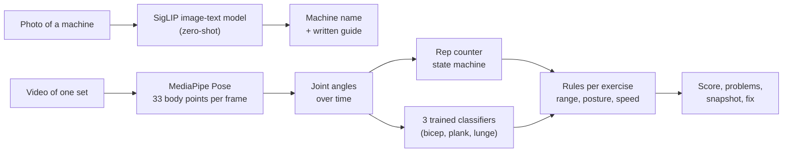

# Gym Form Coach

**Point your phone at a gym machine. Learn how to use it. Film one set. See what to fix.**

A working prototype for people who are new to the gym:

1. **Take a photo of a machine** - the app names it.
2. **Read the guide** - setup, how to do the exercise, common mistakes, safety.
3. **Upload a video of one set** - the app counts reps, gives a score out of 100, shows the frame
   where something went wrong, and says how to fix it.

| Pick or scan a machine | Read the guide | Get your score |
|---|---|---|
|  |  |  |

It runs on a laptop and is used from a browser (also a phone browser on the same Wi-Fi). It is
**not yet an Android APK**; the plan for that is in [docs/07-roadmap-to-apk.md](docs/07-roadmap-to-apk.md).

## How it works



| Part | Technique | Trained here? |
|---|---|---|
| Machine recognition | SigLIP, zero-shot classification | No (pretrained, chosen by measurement) |
| Body tracking | MediaPipe Pose Landmarker (BlazePose) | No (pretrained) |
| Rep counting | Two-threshold state machine on a joint angle | No ML |
| Scoring | Rule engine; every exercise is data in `catalog.json` | No ML |
| Posture checks (3 exercises) | Random forest / small neural network on body-shape features | **Yes** |

No large language model is used or trained. Everything is free and open source, and runs on a CPU.

## Results

| What | Result |
|---|---|
| Machine recognition, first guess | **87%** (53 of 61 hand-checked photos, 16 machines) |
| Machine recognition, right machine in the 3 guesses shown | **97%** |
| Posture classifiers, macro F1 with whole clips held out | 0.991 bicep, 0.996 plank, 0.928 lunge |
| Rule-engine tests | 18 of 18 pass |
| Coverage | 17 machines with guides, 13 exercises with a form check |

Two graphs tell most of the story. All seven, with explanations, are in
[docs/08-training-graphs.md](docs/08-training-graphs.md).

**Choosing the recogniser.** The first model tried (CLIP) was right only half the time. Measuring three
models on the same photos found one that was much better.


**Measuring honestly.** Video frames next to each other are almost identical. Splitting them at random
between training and test makes a model look better than it is. Keeping whole clips together shows the
real number: the lunge model drops from 1.00 to 0.93, on only 11 clips.


## What is not proven yet

- The scoring thresholds are sensible starting values. **A trainer has not checked them.**
- The nine machine exercises were tested with a computer-drawn stick figure, **not with real gym videos**
  (no openly licensed videos were available).
- The posture classifiers were trained on a few people; the lunge one on 11 clips.
- Not yet tested on a real phone.

Full details: [docs/06-test-report.md](docs/06-test-report.md). This app gives general guidance, not medical advice.

## Run it

Needs Windows, Python 3.12, and the reference repository
[Exercise-Correction](https://github.com/NgoQuocBao1010/Exercise-Correction) cloned next to this folder
as `Exercise-Correction-main` (only for retraining and for the demo videos).

```
python -m venv .venv
.venv\Scripts\pip install -r requirements.txt
run.bat
```

Open <http://localhost:8000>. The first start downloads the machine recogniser (about 0.8 GB) and takes
a minute or two; guides and form checks work straight away.

- **From a phone:** `run.bat lan`, then open `http://<your PC's IPv4 address>:8000` on the same Wi-Fi.
  Use this at home, not on public Wi-Fi.
- **Try a form check without a gym:** Dumbbells > Check my form > Upload, and choose
  `Exercise-Correction-main\demo\bc_demo.mp4`.

Rebuild the models, measurements and graphs:

```
.venv\Scripts\python training\train_form_classifiers.py
.venv\Scripts\python training\eval_machine_recognition.py
.venv\Scripts\python training\make_training_graphs.py --measure
.venv\Scripts\python tests\test_analysis.py
```

## Project layout

| Folder | Contents |
|---|---|
| `backend/app/` | FastAPI server and all analysis code |
| `frontend/` | The web page (plain HTML, CSS, JavaScript) |
| `models/` | Pose model, trained classifiers, measurement reports |
| `training/` | Scripts that train, measure and draw the graphs |
| `tests/` | Automatic tests of the rule engine |
| `docs/` | Documentation - start at [docs/README.md](docs/README.md) |

## Credits

- Pose model: Google MediaPipe (Apache 2.0). Machine recogniser: Google SigLIP (Apache 2.0).
- Training data for the posture classifiers, and the demo video shown in the screenshot:
  [Exercise-Correction](https://github.com/NgoQuocBao1010/Exercise-Correction) by Ngo Hong Quoc Bao (MIT).
- Evaluation photos: Wikimedia Commons contributors (not included in this repository).
- Built with the help of Claude Code (Anthropic).
