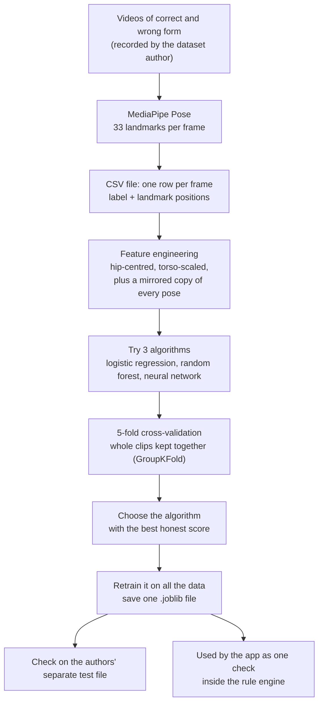
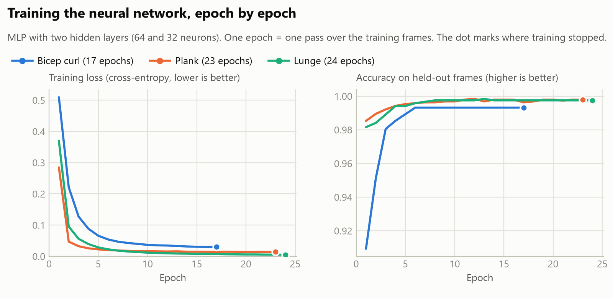
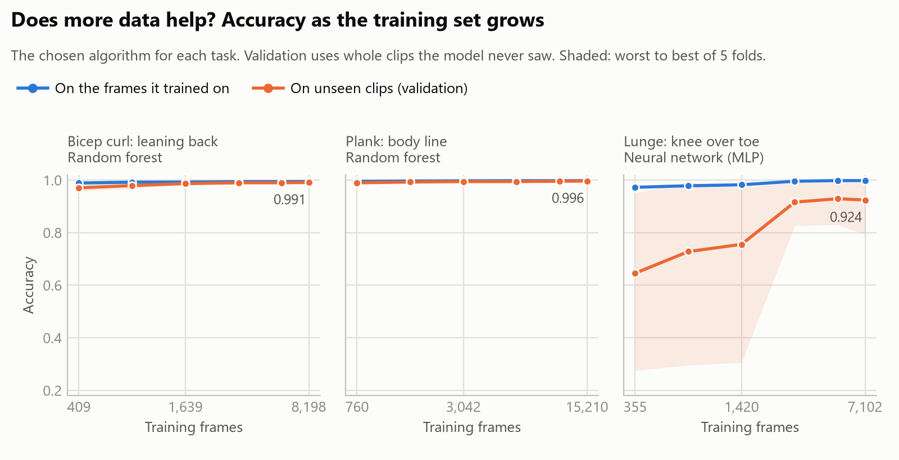
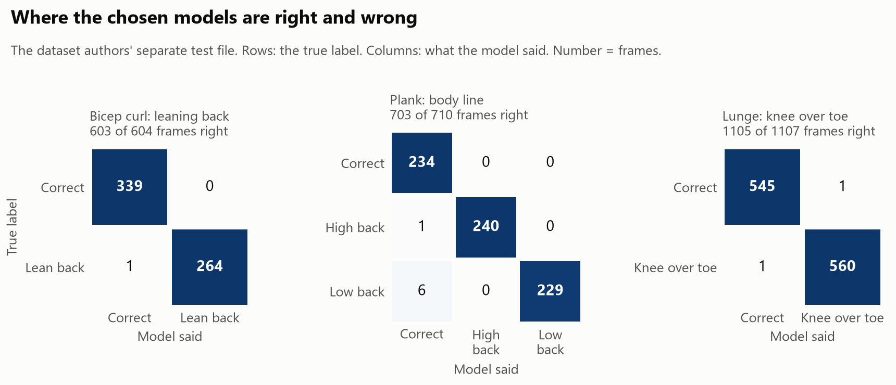
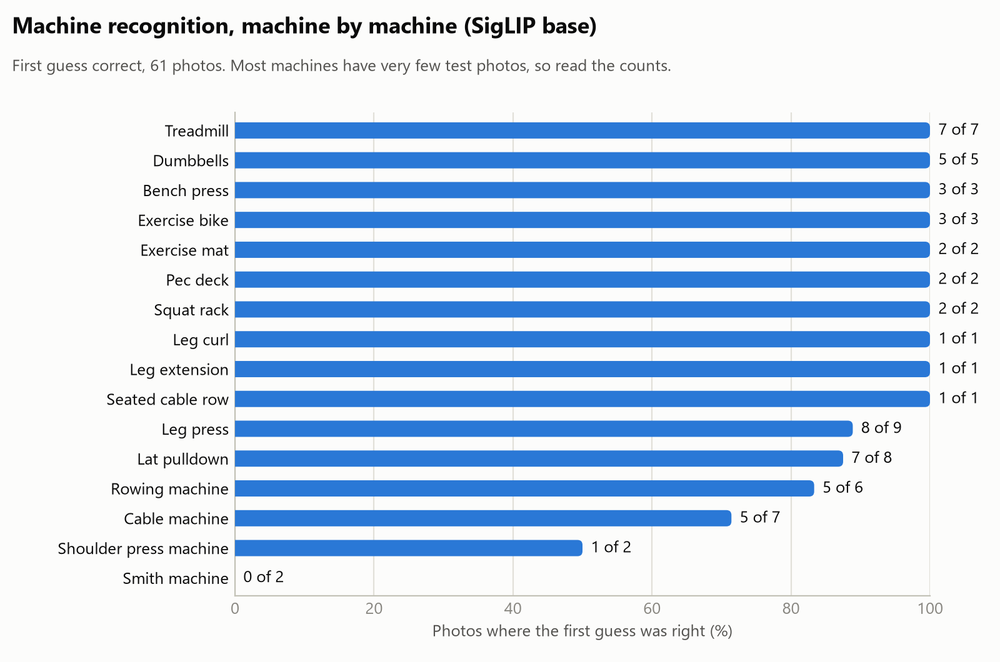
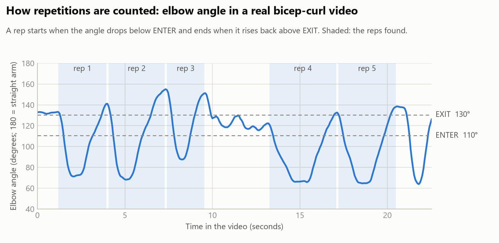

# 8. Graphs: how the models were trained and chosen

**First, one correction of words.** This project does not train a large language model (LLM).
An LLM writes text. Nothing here does that. What *was* trained are **three small posture classifiers**.
The two big models (pose tracking and machine recognition) were **not trained**; they are pretrained,
and one of them was **chosen by measurement**. The graphs below show exactly that.

All graphs are drawn by `training/make_training_graphs.py` from saved measurements
(`models/*.json`), so anyone can redraw them. Every graph has its numbers in a table underneath.

## The training process in one picture



The first three boxes were done by the dataset's author. Everything from "feature engineering"
down is `training/train_form_classifiers.py`.

---

## Graph 1 - A random split makes the models look better than they are


**How to read it.** Each row is one algorithm on one task. The light dot is the score when frames
are split at random. The dark dot is the score when whole clips are held out. The line between them
is how much the random split flatters the model.

**What it shows.** For bicep curl and plank the two scores are close: there are many clips (66 and 221),
so holding clips out costs little. For lunge there are only **11 clips**, and the honest score is much
lower: logistic regression drops from 0.98 to 0.76. The model we chose is the one with the best
**dark** dot, not the best light one.

**Why it matters.** The reference project split frames at random. Its reported accuracy is the light dot.

| Task | Algorithm | Split by clip | Random split |
|---|---|---|---|
| Bicep curl | Logistic regression | 0.968 | 0.971 |
| | Random forest (chosen) | 0.991 | 0.992 |
| | Neural network | 0.984 | 0.992 |
| Plank | Logistic regression | 0.979 | 0.997 |
| | Random forest (chosen) | 0.996 | 0.997 |
| | Neural network | 0.976 | 0.996 |
| Lunge | Logistic regression | 0.762 | 0.982 |
| | Random forest | 0.856 | 0.997 |
| | Neural network (chosen) | 0.928 | 0.997 |

---

## Graph 2 - Training the neural network, epoch by epoch



**How to read it.** Left: the **loss**, the model's error on the training frames. Training means
pushing this number down. Right: accuracy on 10% of frames kept aside. An **epoch** is one full pass
over the training data.

**What it shows.** The loss falls fast in the first five epochs, then flattens: the network has learned
what it can. Training stops by itself when the held-out accuracy has not improved for 10 epochs
(**early stopping**), after 17 to 24 epochs. Stopping early avoids memorising the training frames.

**A warning about the right-hand panel.** Those held-out frames are a *random* 10%, so they are near
copies of training frames. The 0.99+ accuracy here is the flattering kind from graph 1. It is useful
for deciding when to stop, not for judging the model.

| Task | Epochs | Loss, first epoch | Loss, last epoch | Held-out accuracy, last epoch |
|---|---|---|---|---|
| Bicep curl | 17 | 0.509 | 0.030 | 0.993 |
| Plank | 23 | 0.285 | 0.014 | 0.998 |
| Lunge | 24 | 0.370 | 0.005 | 0.998 |

Random forests do not train in epochs, so they have no curve like this. They appear in graph 3.

---

## Graph 3 - Does more data help?



**How to read it.** From left to right the model gets more training frames. Blue is accuracy on frames
it trained on. Orange is accuracy on clips it never saw. The shaded band runs from the worst of the 5
folds to the best.

**What it shows.**

- **Bicep curl and plank:** orange almost touches blue and is already flat. More of the *same kind* of
  data would add little.
- **Lunge:** a wide gap, and a very wide band. With little data the worst fold is 0.28 - worse than
  guessing. Even with all the data the worst fold is 0.79. The model depends heavily on *which* clips
  it happened to see. That is what 11 clips looks like.

**What to do about it.** Lunge needs more clips from more people, not a bigger model. All three need
*different* data (new people, new rooms) before these numbers mean much outside this dataset.

| Task | Training frames | Accuracy on training frames | Accuracy on unseen clips | Worst fold | Best fold |
|---|---|---|---|---|---|
| Bicep curl (random forest) | 409 | 0.989 | 0.970 | 0.958 | 0.983 |
| | 8,198 | 0.994 | 0.991 | 0.987 | 0.995 |
| Plank (random forest) | 760 | 0.995 | 0.990 | 0.986 | 0.995 |
| | 15,210 | 0.998 | 0.996 | 0.994 | 0.998 |
| Lunge (neural network) | 355 | 0.972 | 0.646 | 0.276 | 0.952 |
| | 1,420 | 0.982 | 0.756 | 0.306 | 0.971 |
| | 7,102 | 0.998 | 0.924 | 0.793 | 0.990 |

*This graph uses accuracy, not F1. With so few clips, a validation fold can contain only one class, and
macro F1 on a single class is not meaningful. The first version of this graph used F1 and wrongly
showed the lunge model at 0.58.*

---

## Graph 4 - Where the chosen models are right and wrong



**How to read it.** Each row is what was really happening. Each column is what the model said. Numbers
on the diagonal are correct answers; anything else is a mistake.

**What it shows.** Almost no mistakes: 603 of 604, 703 of 710, 1,105 of 1,107. The only pattern is
six "low back" planks called "correct".

**Why not to celebrate.** This test file was very likely recorded in the same sessions as the training
data (same people, same room). Graph 3 is the more honest picture.

---

## Graph 5 - Choosing the machine recogniser


**How to read it.** Three pretrained models answer the same question on the same 61 photos:
"which of 17 machines is this?" None was trained on gym photos (zero-shot).

**What it shows.** The first model tried, CLIP ViT-B/32, got the first guess right about half the time.
A second CLIP with finer image patches was no better. SigLIP was right 87% of the time, and the right machine was among the three
guesses the app shows in 97% of photos. This is **model selection**: no training, only measuring.

| Model | First guess right | Right machine in top 3 |
|---|---|---|
| CLIP ViT-B/32 | 51% | 67% |
| CLIP ViT-B/16 | 44% | 70% |
| SigLIP base (chosen) | 87% | 97% |

---

## Graph 6 - Machine recognition, machine by machine



**How to read it.** One bar per machine, for the chosen model. The label says how many photos were right
out of how many were tested.

**What it shows.** Most machines are recognised. The Smith machine was missed in both photos, and cable
machines are sometimes called a lat pulldown (they look alike). **Read the counts:** several bars rest on
one or two photos, so "100%" there means very little. Chest press has no test photo at all.

---

## Graph 7 - How repetitions are counted



This one is not training. It shows the rule that turns a video into reps, on a real bicep-curl video.

**How to read it.** The line is the elbow angle (180 = straight arm). A rep begins when the line drops
below ENTER and ends when it climbs back above EXIT. ENTER and EXIT are set from the range of *this*
video, not fixed numbers.

**What it shows.**

- Five reps are found. The small wobble between 10 and 13 seconds never crosses ENTER, so it is not counted.
- A sixth curl begins at 21 seconds, but the video ends before the arm comes back up, so it is not counted.
- Rep 3 is shallow: the elbow only reaches 88 degrees. The app reports it as "not curling all the way up".
- The arm rarely returns above 150 degrees at the bottom. The app reports "arms not straight at the bottom".

---

## Redraw the graphs

```
.venv\Scripts\python training\make_training_graphs.py             draw from saved measurements (seconds)
.venv\Scripts\python training\make_training_graphs.py --measure   retrain and re-measure first (about 6 minutes)
```

Colours come from a palette checked for colour-blind readers. Light background only.
